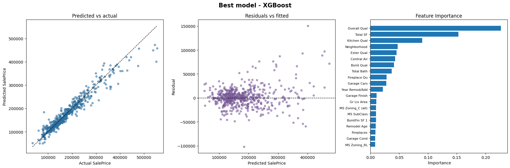

# PropertyValuePredictor


Predicting property prices with machine learning using the **Ames Housing Dataset**.
I created this project as a task for the AI club at Jagiellonian University.
The goal was to build and compare multiple models capable of estimating residential property prices based on 79 characteristics describing each house.

## Dataset - Ames Housing
I used the [Ames Housing Dataset](https://www.kaggle.com/datasets/shashanknecrothapa/ames-housing-dataset) from Kaggle. It contains data on residential house sales in *Ames, Iowa*, during the years 2006–2010. The dataset consists of *2,930* house sale records, each with *79 features*. The features include both numerical and categorical variables, such as *lot size, number of rooms, foundation type, sale type, and more*.

The data contained many missing values. The target (SalePrice) was right-skewed, so I applied a log transform to it. The Ames Housing dataset has many string (categorical) features, so it was necessary to encode them — I used one-hot encoding for low-cardinality features, and target/ordinal encoding for high-cardinality ones, to avoid an explosion of columns.

When working with this dataset, it's important to remove outliers. I knew there were a few large properties sold very cheaply, so I created a manual filter to detect them. I also ran Isolation Forest (with a 5% contamination rate) on the training set. Finally, I scaled the data using `StandardScaler`.

## Models

The task required the use of three models: **linear regression, decision trees, and polynomial regression**. I also decided to try some more advanced models: **regularized polynomial regression, random forest, HistGradientBoosting, and XGBoost**.

Linear regression performed surprisingly well — better than I expected — except on the cross-validation metrics, where it fell behind the boosting models. The tree-based models could probably have done better; the dataset was likely too small for them to show their full advantage.

I'm pleased with the project's results. *Human appraisers who evaluate homes are typically off by an average of 10–15%.* The models I trained achieved similar results. **XGBoost turned out to be the best model**, mispredicting the price by 10.9% on average.

### Models' results, sorted by cross-validation R² (log)
|                      |    RMSE $    |     MAE $    |  R² (log) |   RMSLE   | CV R² (log) |  CV RMSLE |
|----------------------|:------------:|:------------:|:---------:|:---------:|:-----------:|:---------:|
| XGBoost              |   20677.56   | **13414.00** | **0.920** | **0.113** |  **0.918**  | **0.109** |
| HistGradientBoosting |   21575.39   |   13671.16   |   0.918   |   0.115   |    0.916    |   0.110   |
| Polynomial Lasso     |   22023.98   |   15535.89   |   0.895   |   0.130   |    0.898    |   0.121   |
| Random Forest        |   26666.77   |   16010.54   |   0.889   |   0.134   |    0.895    |   0.123   |
| Linear regression    | **19761.25** |   13733.60   |   0.911   |   0.119   |    0.857    |   0.134   |
| Decision Tree        |   29289.72   |   19941.20   |   0.828   |   0.166   |    0.818    |   0.161   |

You may notice that I didn't use the most common metrics. This is due to the specific nature of the data I was working with. Plain MSE was too large in scale (prices squared, ~20000²), so I decided to use RMSE and MAE instead, which stay in dollar terms and are easier to interpret. I also measured performance using RMSE on log-transformed `y_true` and `y_pred` — that's RMSLE. This shows not how many dollars the prediction is off by on average, but roughly what percentage it's off by. R² is likewise calculated on log-transformed `y`, which gives the metric more stability; otherwise, one large misprediction would destabilize the result significantly. Finally, I also computed R² and RMSLE via cross-validation, for a more reliable estimate of generalization performance.



## Installation and setup
1. **Clone the repository from GitHub**
    ```
    git clone ...
    cd PropertyValuePredictor
    ```
2. **Create a virtual environment and install dependencies**

   Linux / macOS:
    ```console
    python -m venv .venv
    . .venv/bin/activate
    pip install -r requirements.txt
    ```

    Windows:
    ```console
    python -m venv .venv
    .venv\Scripts\activate
    pip install -r requirements.txt
    ```
3. **Open the notebook**
   - ```solve-eng.ipynb```
   - ```solve-pol.ipynb```

## Project structure
```console
PropertyValuePredictor/
│
├── data/                        # Dataset (ignored)
├── .venv/                       # Virtual environment (ignored)
│
├── solve-eng.ipynb              # English notebook
├── solve-pol.ipynb              # Polish notebook
│
├── task-description.md          # Original assignment
├── data-description.txt         # Ames feature descriptions
├── project-presentation.pdf     # University presentation
│
├── requirements.txt
├── README.md
└── .gitignore
```